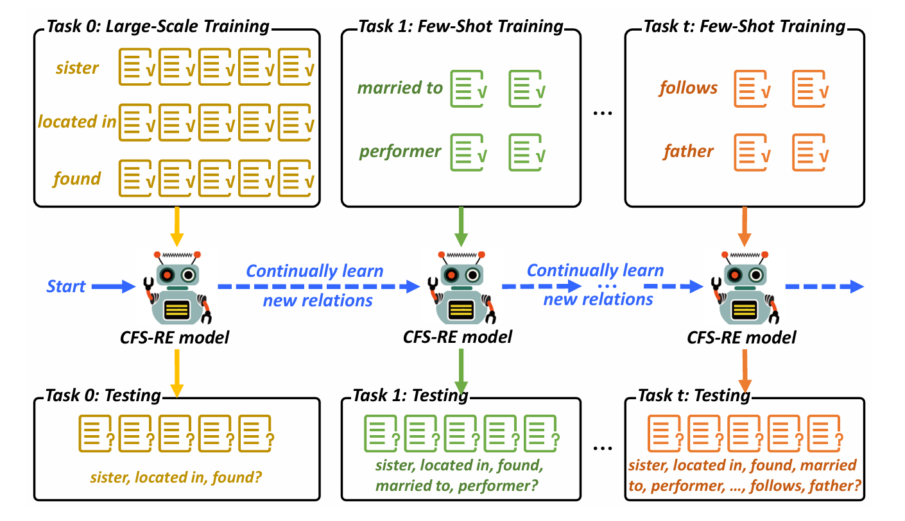
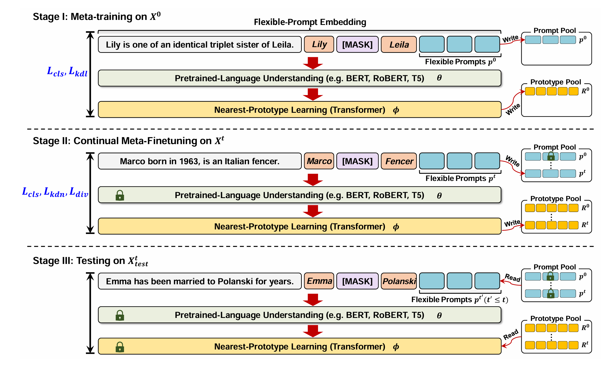
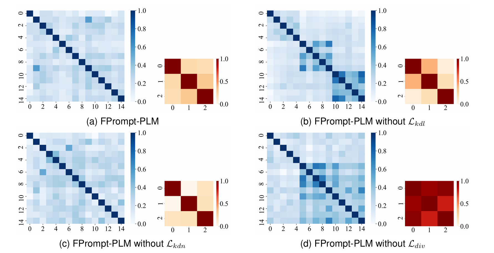
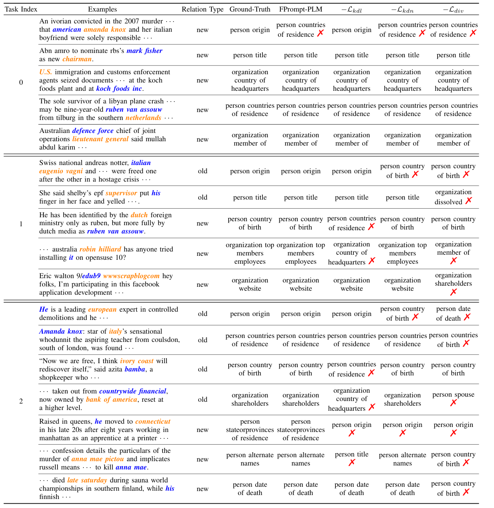

# FPrompt-PLM: Flexible-Prompt on Pretrained Language Model for Continual Few-Shot Relation Extraction

This repository provides PyTorch implementation for the paper [*FPrompt-PLM: Flexible-Prompt on Pretrained Language Model for Continual Few-Shot Relation Extraction*] **TKDE Under Review**

## Introduction

The learning paradigm of CFS-RE.



Relation extraction (RE) aims to identify the relation between two entities within a sentence, which plays a crucial role in information extraction. The traditional supervised setting on RE does not fit the actual scenario due to the continuous emergence of new relations and the unavailability of massive labeled examples. Continual few-shot relation extraction (CFS-RE) is proposed as a potential solution to the above situation, which requires the model to learn new relations sequentially from a few examples. Apparently, CFS-RE is more challenging than previous RE, as it involves the catastrophic forgetting of old knowledge and few-shot overfitting on a handful of examples.

To address these challenges, we propose a novel flexible-prompt framework on pretrained language model named FPrompt-PLM for CFS-RE. This framework includes flexible-prompt embedding, pretrained-language understanding, and nearest-prototype learning modules. It should be noted that two pools in FPrompt-PLM, namely prompt and prototype pools, are continually updated and applied for the prediction of all seen relations at the current time-step. The former pool records the distinctive prompt embedding in each time period, while the latter records all learned relation prototypes. Additionally, three progressive stages are introduced to learn FPrompt-PLM's parameters and apply this model for CFS-RE testing, which include meta-training, continual meta-finetuning, and testing stages.

Furthermore, we improve the CFS-RE loss by incorporating multiple distillation losses as well as a novel prototype-diversity loss in these stages to alleviate the catastrophic forgetting and few-shot overfitting problems. Comprehensive experiments on two widely-used datasets show that FPrompt-PLM achieves significant performance improvements over the state-of-the-art baselines.



## Case Study

Similarity heatmaps among 15 prototypes and 3 prompts after the learning stage on X2 data over TACRED dataset. The sentence encoder is BERT Base.

<p align="center">
    
</p>

The case study on TACRED involves marking the head/tail entities in blue/orange and indicating wrong results with ✗.



## Requirements

```
pip install -r requirements.txt
```

## Dataset

We conduct the split on FewRel and Tacred dataset in dataset directory. 

Please take a look at our paper for details of the split.


## Citation
**Coming Soon...**

